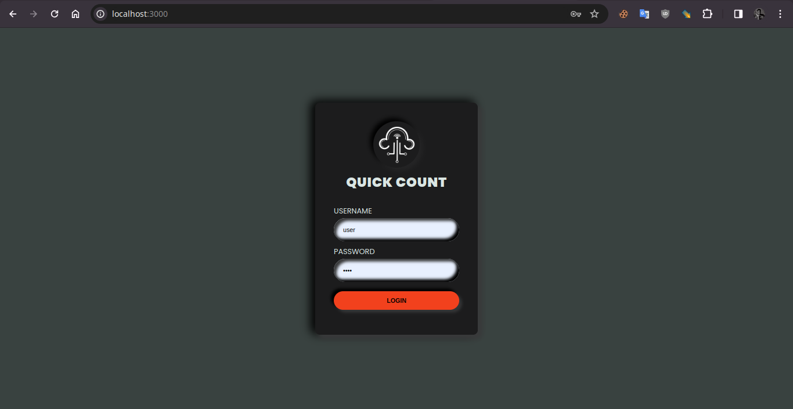
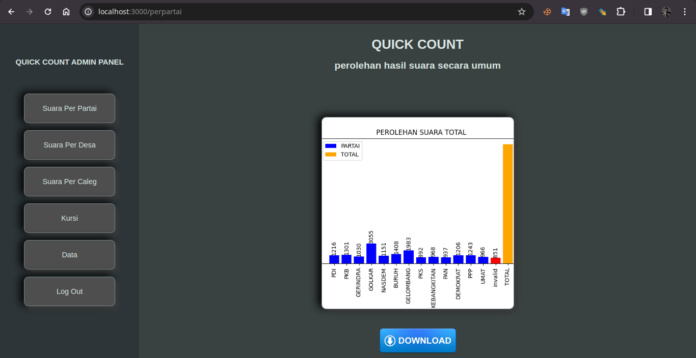
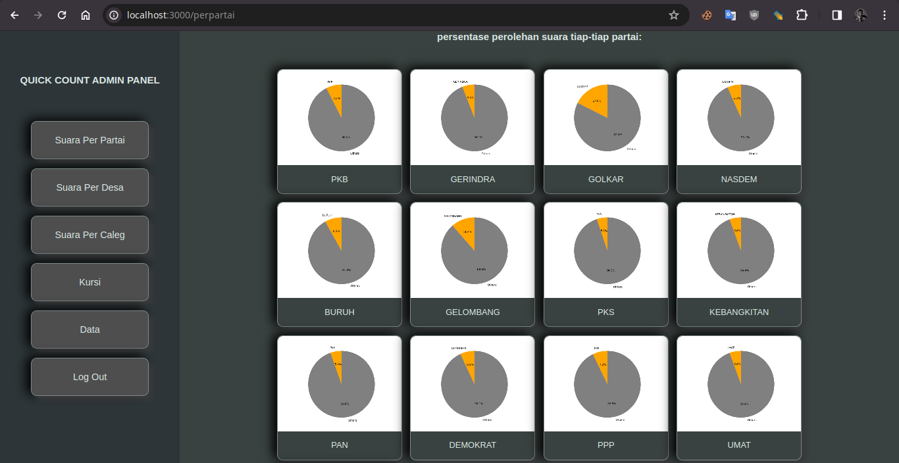
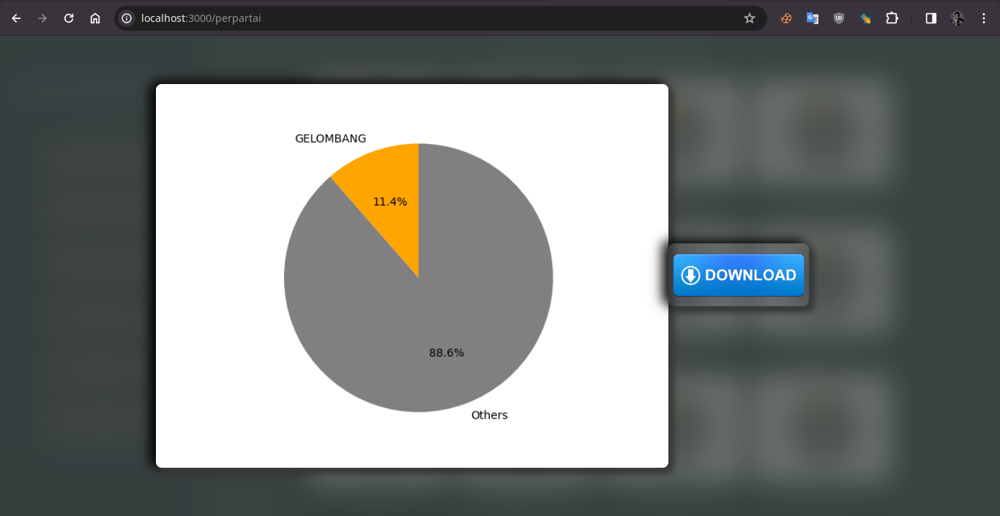
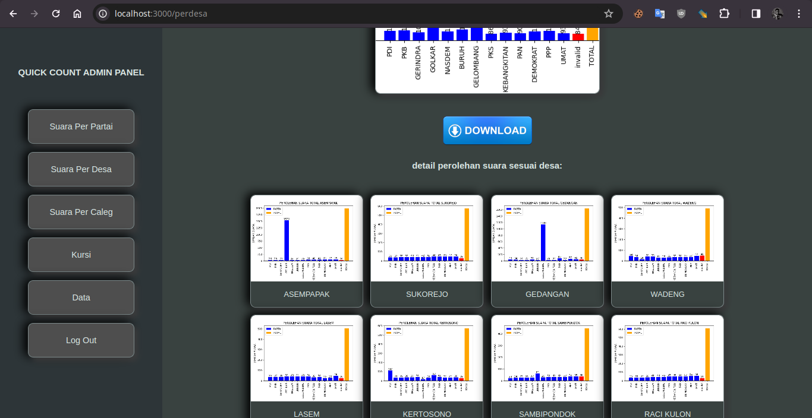
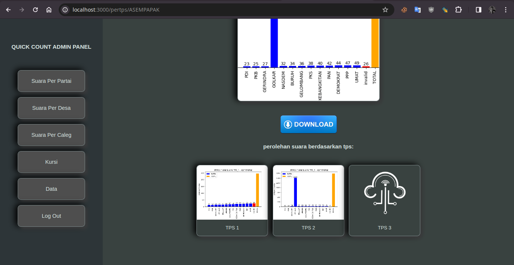
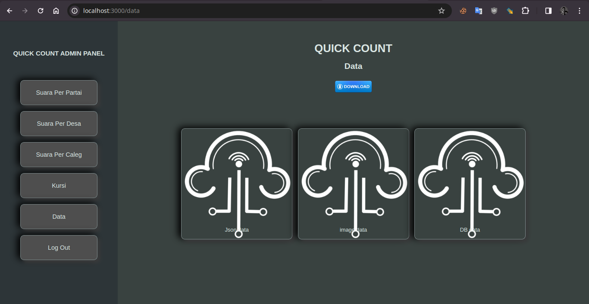
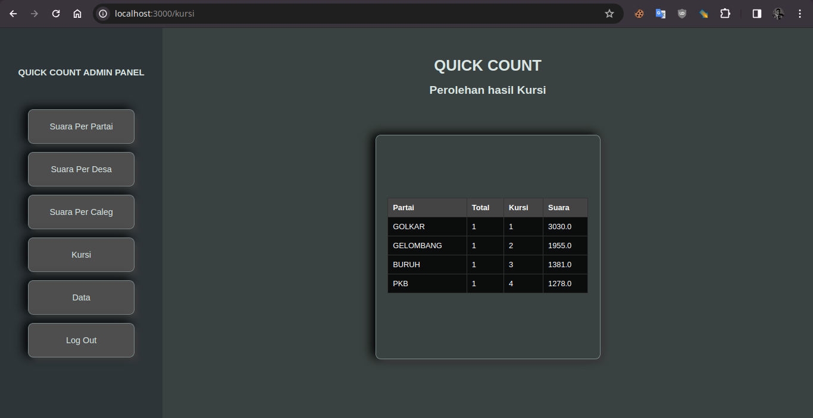

# Quick Count

here a flask app for quick count on indonesian election 2024

## overview

- 
- 
- 
- 
- 
- 
- 
- 

## what do u need

- u need to have a google drive api key
- min python 3.9 installed
- a liitle bit understanding about flask and webui control

## how to use

- clone this repo
- add your data to the respective google drive folder (for image and json)
- (optional) generate a virtual env
- edit the .secret files located on `code/flamework/global`
- install the requirements
- run the `app.py` code located on `code/interface`
- u can also change the image by changing the image on `code/interface/icons` but make sure to don't use another name if u dont want to edit more the code.
